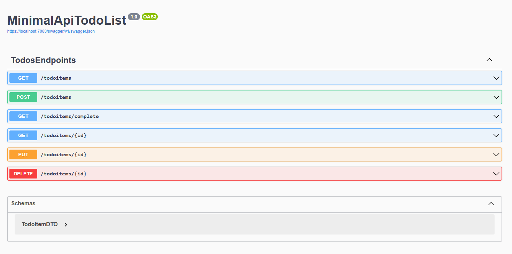

# MinimalApiTodoList

- simple todo minimalApi app built with .net 8.0. 
- uses in-memory database
- This app is built based on the tutorial from [Microsoft Learn](https://learn.microsoft.com/en-us/aspnet/core/tutorials/min-web-api?view=aspnetcore-8.0&tabs=visual-studio)

## Improving MinimalApiTodoList architecture

- source: [source blog](https://www.tessferrandez.com/blog/2023/10/31/organizing-minimal-apis.html)

- in this step following the blog I've moved all of Todo-related code into Todo directory. 
- `Program.cs` is now referencing Todo related code from Todo directory.

```csharp
using Microsoft.EntityFrameworkCore;
using MinimalApiTodoList.TodoItems;

var builder = WebApplication.CreateBuilder(args);

builder.Services.AddDbContext<TodoDb>(opt => opt.UseInMemoryDatabase("TodoList"));
builder.Services.AddDatabaseDeveloperPageExceptionFilter();

var app = builder.Build();

app.RegisterTodosEndpoints();

app.Run();
```

- - it helps to keep the code organized and clean. Scalability is also improved.

## Manually adding OpenApi support


- source [Microsoft Learn](https://learn.microsoft.com/en-us/aspnet/core/fundamentals/minimal-apis/openapi?view=aspnetcore-8.0)

- Added the following packages
```bash
dotnet add package Microsoft.OpenApi
dotnet add package Swashbuckle.AspNetCore
```

```csharp
using Microsoft.EntityFrameworkCore;
using MinimalApiTodoList.TodoItems;
using Microsoft.AspNetCore.OpenApi;

var builder = WebApplication.CreateBuilder(args);

builder.Services.AddDbContext<TodoDb>(opt => opt.UseInMemoryDatabase("TodoList"));
builder.Services.AddDatabaseDeveloperPageExceptionFilter();

builder.Services.AddEndpointsApiExplorer();
builder.Services.AddSwaggerGen();

var app = builder.Build();

if (app.Environment.IsDevelopment())
{
    app.UseSwagger();
    app.UseSwaggerUI();
}

app.RegisterTodosEndpoints();

app.Run();

```

- now the Swagger UI is available at `https://localhost:5001/swagger/index.html`



## Additional links

- [Microsoft Learn Minimal Api Reference](https://learn.microsoft.com/en-us/aspnet/core/fundamentals/minimal-apis?view=aspnetcore-8.0)
- [Microsoft Learn Minimal API tutorial - PizzaStore](https://learn.microsoft.com/en-us/training/modules/build-web-api-minimal-api/2-what-is-minimal-api)